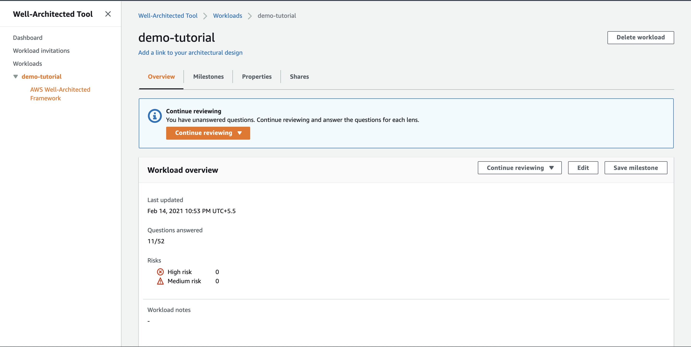

## WALKTHROUGH OF THE WELL-ARCHITECTED TOOL

**Introduction** 
- AWS Well-Architected Framework assists architects to architect secure, scalable, durable, and efficient workload and it consists of five pillars 
    - Operational Excellence, 
    - Security, 
    - Reliability, 
    - Performance Efficiency, and 
    - Cost Optimization 
- It is a repeatable framework that assists customers and partners to validate the architectures and design that can scale over time.
- The AWS WA Tool, which is free at no cost and available under AWS Management Console, provides a way to regularly validate your workloads, discover potential issues, and capture your improvements.  

**Step 1 - Access Well-Architected Tool**
- In order to access AWS Well-Architected Tool, we need to simply login and navigate in the AWS console as we do for any other AWS services

  
**Step 2 - Generate a workload**
- AWS Well-Architected review is conducted on each workload and a workload consists of a couple of components or business deliverables which has any business value associate with it.
- Let's now define a workload and follow the below steps for it
  
  - Click Define Workload on the Well-Architected home page:
    
    
  
  - Next, provide the workload properties such as
    
     - Unique Workload Name
     - Workload description 
     - Review onwer name/email-id
     - Environment stage (Production/Non-Production)
     - AWS Region in which workload is deployed
     - AWS Account Ids
     - Industry type
    
    
    
   - Click Next after defining workload properties at the bottom of the page
   
    
    
   - Post workload properties section we will lend on Apply lenses page, for this tutorial, we will opt for default AWS Well-Architected Framework 
   
   - Finally, click Define Workload to finish workload creation
    
    
    
**Step 3 - Perform Well-Architected Review**
- This is an interative and interactive step, we should interview all technical stakeholders to gather all the required data points and accordingly answer each question across different pillars, in total there are 52 questions.

    

- UI screen for review is very informative as shown below
  
    
    
    - 1. Each option consist of an Info section on the right panel to understand the asks
    - 2. Via left panel, you can traverse to any questions across different Well-Architected pillars
    - 3. The notes section is an optional field but helpful to provide more description on your implementation with context to that particular question
    - 4. With the Next button, you can slide to the next question and with Save & Exit button you can save and close the review

**Step 4 - Save a milestone**
- Post the review process is completed, we need to define a milestone and that is done by clicking the Save milestone button

- Enter a name for the milestone and click the Save button:

- Post the milestone is created successfully, we can retrieve information about it under the Milestone section

**Step 5 - Verify & Download Report**
- Finally, we download the review report, and below are the steps to generate & download the report

  - From the detail page for the workload, click the AWS Well-Architected Framework navigation item (others navigation items would appear for any applied Well-Architected Lens)
  
  
  
  - Click the Generate Report button to generate and download the report
  
  
